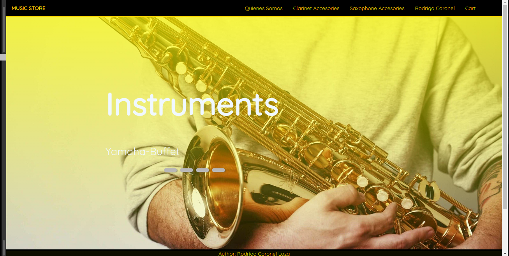
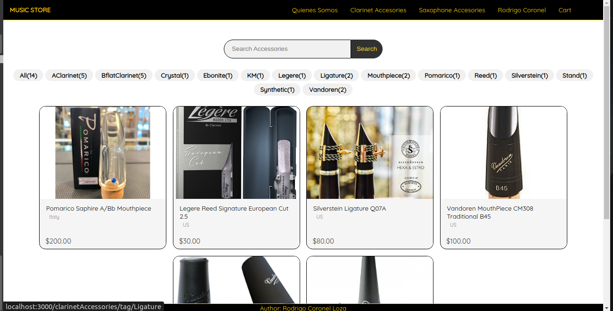
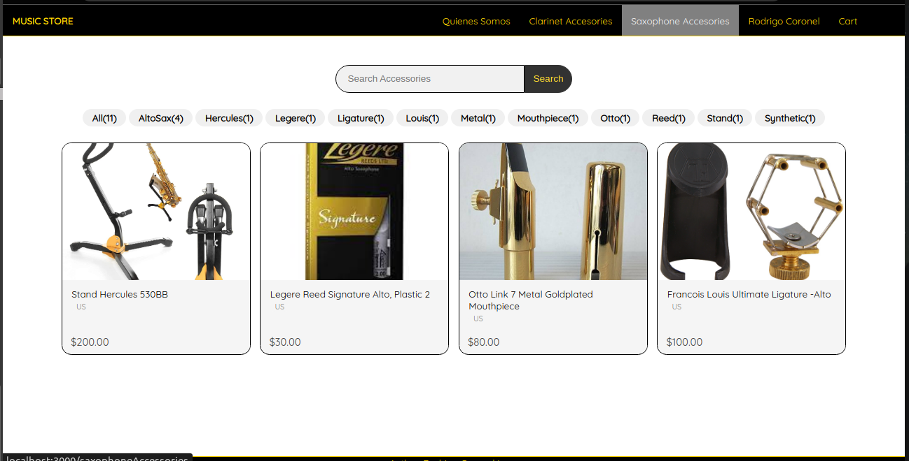
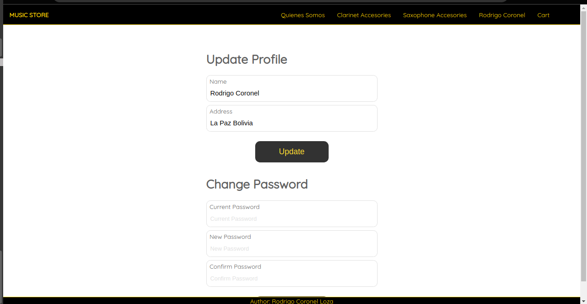
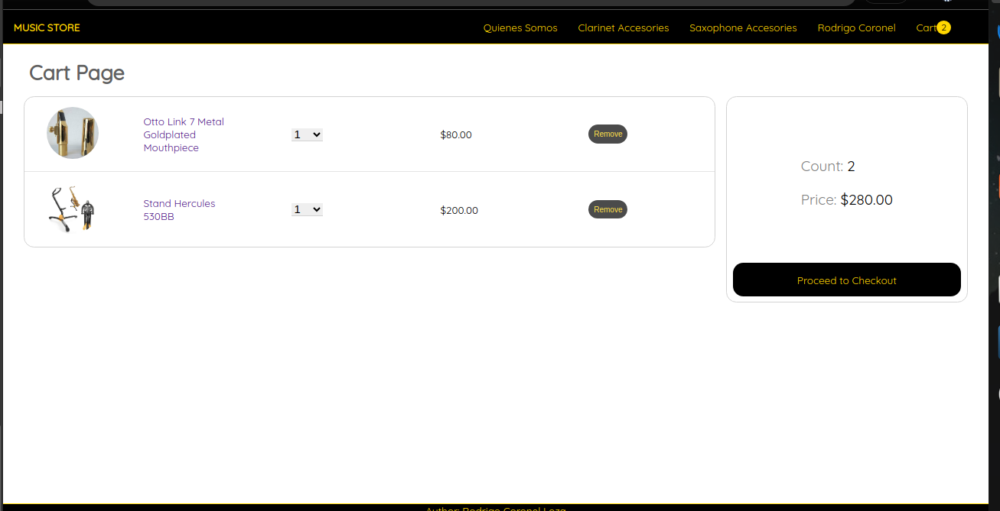
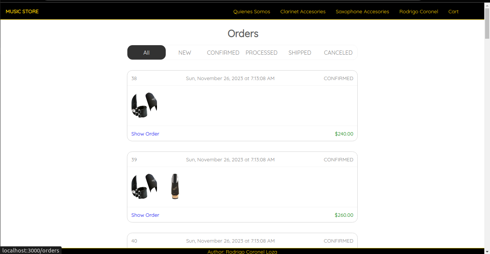
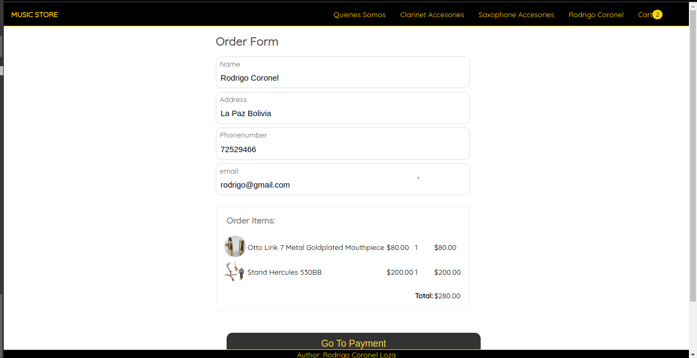
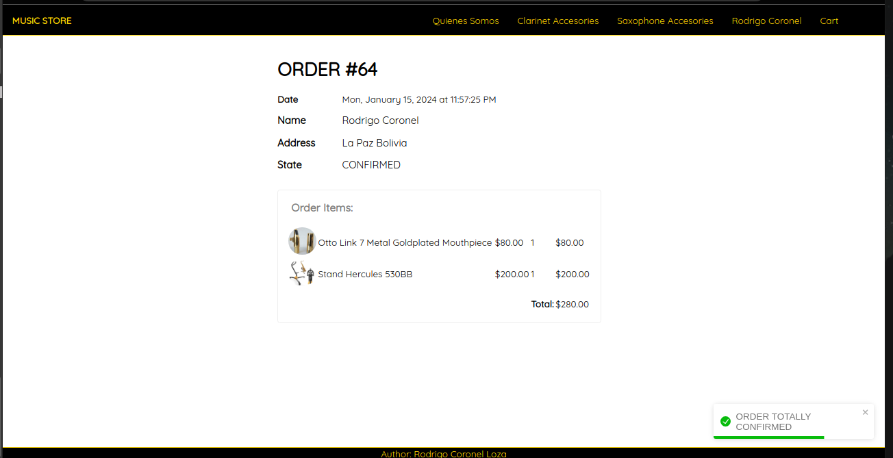

# MUSIC STORE

It a music store for clarinets and saxophones where we can see, command  intruments and accesories. It is possible the create a user to login, and then the logged user can do the shopping. 
The user can see his order, and the super user can see the list of all the orders.

## Installation

1. Clone the repo
   ```
   git clone git@github.com:RodrigoCoronelLoza/citomap_react.git
   ```
2. Install NPM packages
   ```
   npm install
   ```
### Frontend 

3. Start the project
    ```
    cd frontend
   npm start
   ```
In your web browser enter the address : [http://localhost:8000](http://localhost:3000) or [http://127.0.0.1:8000/](http://127.0.0.1:3000/)

### Backend
```
    cd backend
   npm run dev
   ```


## Running

Home



Accessories

 

Login/Profile



Cart



Orders

  

## Dependencies

Some important dependencies
The database was done in MySQL, the backend part is done using axios and express and the frontend uses reactjs
